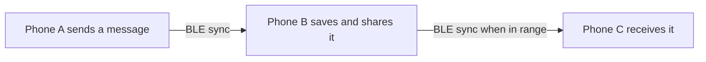
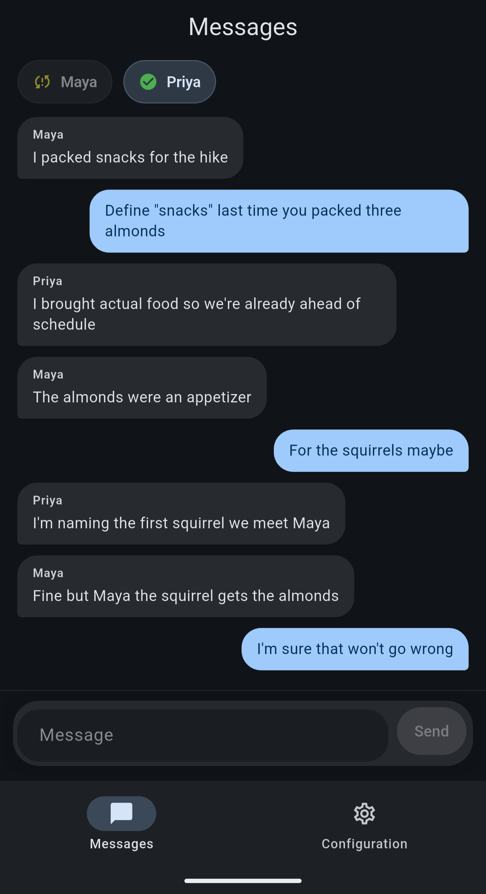

# Meshenger

Meshenger is a nearby chat app for Android. Phones discover one another over Bluetooth Low Energy (BLE) and exchange chat history directly, without Wi-Fi, mobile data, or a central server.

## Download

When a release is available, download Meshenger from the [GitHub Releases page](https://github.com/ebregger/Meshenger/releases). Choose the **universal APK** for most Android phones. The other APKs are split by processor type. Download only from the project’s Releases page.

## How the mesh works

Each phone is an equal participant in the mesh. It keeps its own local copy of the chat and continuously looks for nearby Meshenger phones while Bluetooth is available.

When a phone finds a peer, the two compare compact fingerprints of their local data. If the fingerprints differ, they connect over BLE and exchange the records each side is missing. Both phones merge the received records into their local chat. The conversation can therefore catch up in either direction.

Messages can travel across multiple phones through repeated exchanges. For example, if A can reach B and B can reach C, A’s message can reach C when C syncs with B. B stores and shares the same chat history; it does not route a live packet to a specific destination. Phones do not need to be on the same Wi-Fi network.

Sync happens when nearby phones discover one another and have an opportunity to connect. It is not guaranteed to be immediate, especially when phones are out of range, Bluetooth permissions are unavailable, or Android restricts background activity.

## Privacy

Meshenger has no central server, but the current mesh traffic is **not encrypted**. Messages, user IDs, and display names are sent as readable data over Bluetooth. Nearby people with suitable BLE tools may be able to capture that traffic, even if they do not use Meshenger. Treat the shared chat as public to people within radio range. Do not send sensitive information.

## Screenshots

  

## Get started

1. Install the APK on two or more Android phones.
2. Turn on Bluetooth and allow the requested nearby-device permissions.
3. Open Meshenger on each phone and keep the screens on while trying the first sync.
4. Send a sample message. Nearby peers should appear as chips, and the message should arrive as the phones sync.

The **Messages** tab contains the shared conversation and nearby peers. Tap a peer chip to see its details. The **Configuration** tab lets you set a display name, check permissions and radio diagnostics, and restart the mesh radio if discovery or syncing stalls.

## Current capabilities

- Android app with BLE peer discovery and direct phone-to-phone data exchange.
- Shared chat history that syncs and merges across peers, including through a phone that is in range of both sides.
- Display names, peer presence indicators, sync status, and basic radio diagnostics.

Keep the app open and phones nearby while evaluating sync. Android background and battery limits can interrupt scanning or connections when the app is not in use.

## Planned work

- Keep BLE scanning and connections active more reliably in the background with an Android foreground service.
- Show local notifications for incoming messages.
- Decide and implement a stronger privacy model, including encryption if private conversations are needed.
- Add chat history clearing and retention controls.
- Support direct one-to-one conversations.
- Add message timestamps, copy actions, and clearer delivery progress.
- Configure release signing with a consistent release keystore.
