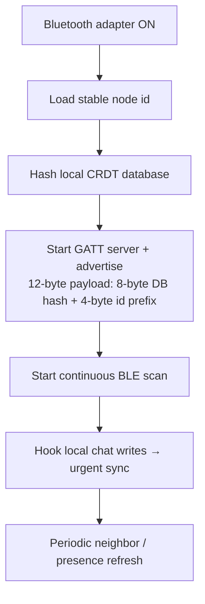
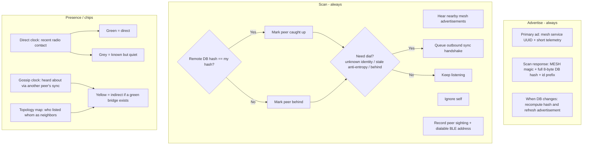
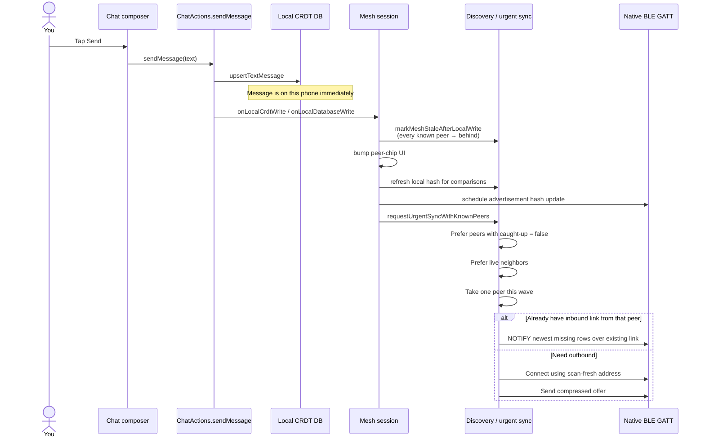
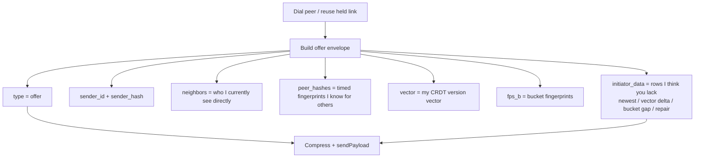
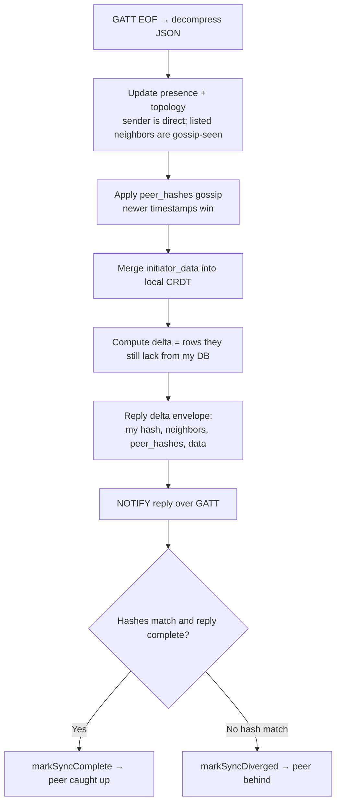
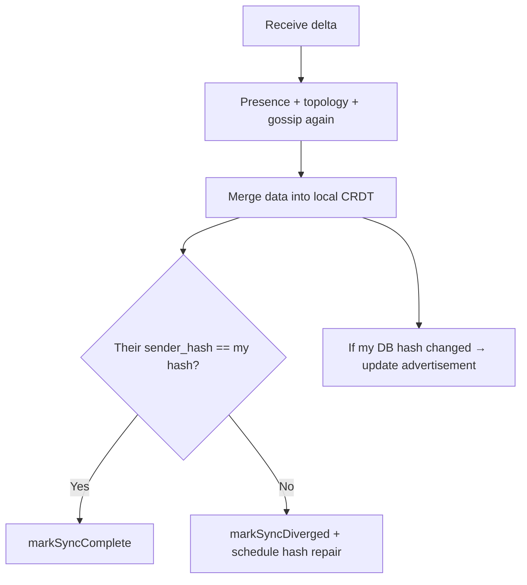
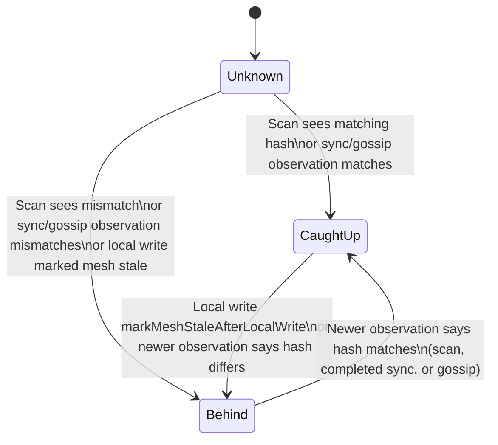
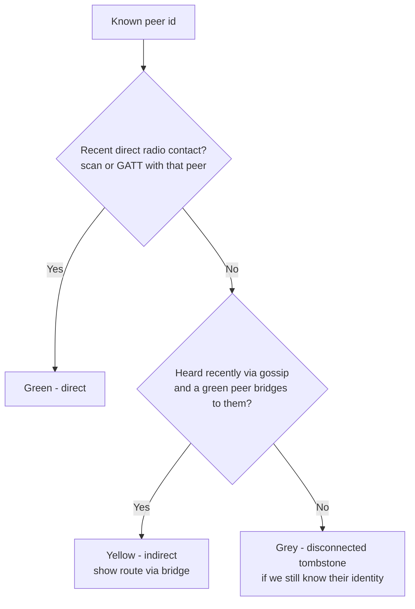
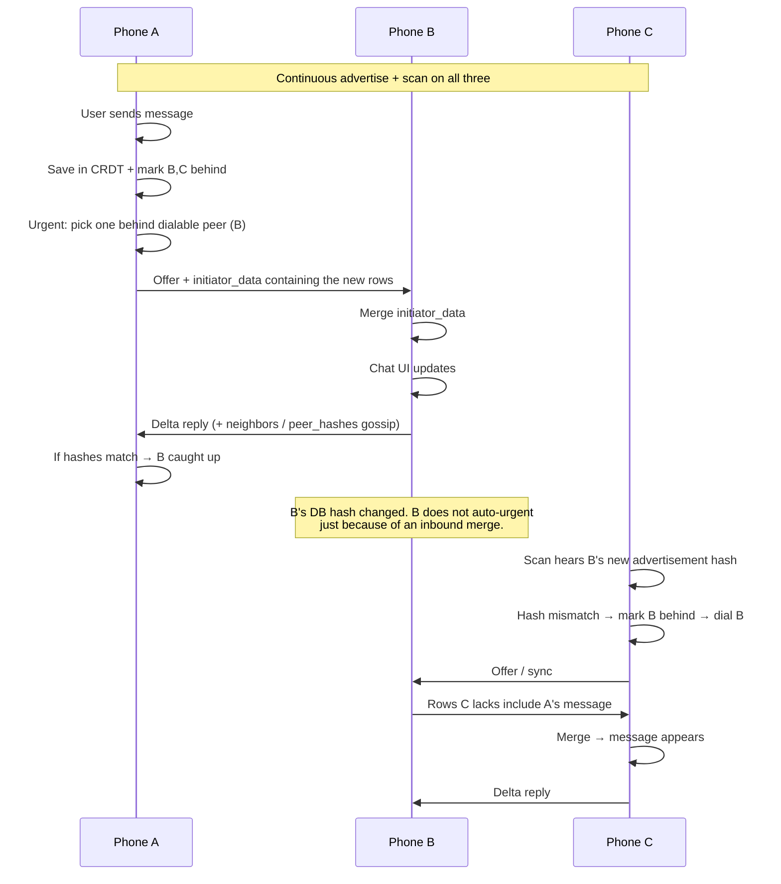
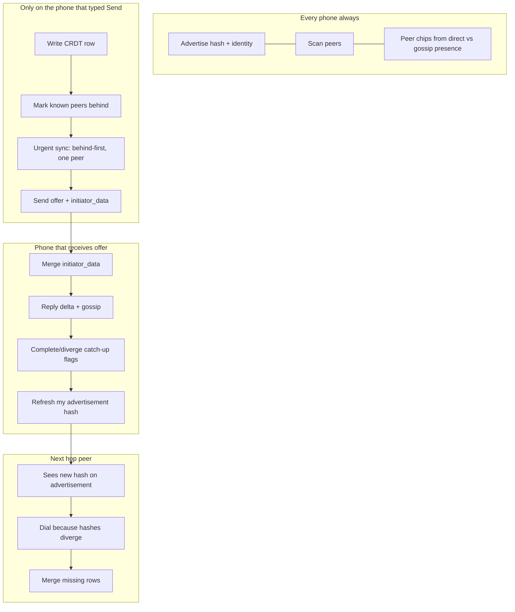

# Bluetooth Mesh Chat

A peer-to-peer chat app that syncs messages over Bluetooth Low Energy — no Wi‑Fi or cellular required. Nearby phones form a small mesh and share chat history automatically.

Building or debugging the project? See **[DEVELOPMENT.md](DEVELOPMENT.md)**.

---

## What you need

- An Android phone (API 24 / Android 7 or newer)
- Bluetooth turned on
- Nearby Devices / Bluetooth permissions allowed when prompted  
  (on older Android, Location may also be required for BLE scanning)

Install the app on two or more phones that are near each other. Each phone is one node in the mesh.

---

## How the mesh works

Every phone runs the same app. There is **no server phone**. Messages live in a local **CRDT database** on each device; Bluetooth is only used to exchange missing pieces until everyone’s database fingerprint matches.

Important correction vs a classic “relay packet” mesh:

> Phones do **not** forward chat messages as packets to a destination.  
> They **merge database rows**. Multi-hop means: A updates B’s DB → B’s advertised fingerprint changes → C notices B diverged and syncs with B → C merges the same rows A originally wrote.

---

### 0. Session start (once Bluetooth is on)

On each phone, when the mesh session starts:

After that, advertise + scan run continuously until Bluetooth drops or you restart the mesh radio.

---

### 1. Continuous jobs on every phone

What the scan path also enforces (kept because it changes behavior):

- If **any dialable peer is known behind**, do **not** spend the outbound radio on a peer already marked caught up.
- After a local write, scan briefly yields so **urgent push-on-write** can use the radio first.
- For idle “we match but haven’t talked in a while” anti-entropy, only one side dials (node-id prefix election) so both phones don’t connect at once.

Omitted from charts on purpose: cooldown timers, byte size caps, scanner watchdog intervals, lease millisecond formulas, log lines.

---

### 2. Send path (UI → radio) — exact order

`onLocalDatabaseWrite` does all of: mark peers behind, refresh comparison hash, update ADV, **and** start urgent sync. A separate DB watcher also refreshes ADV on message/profile changes, but **only the chat write hook** triggers urgent push (so inbound merges don’t stampede the radio).

---

### 3. Sync handshake (what “connect” actually exchanges)

Wire format over GATT: **zlib-compressed JSON**, chunked until an EOF marker.

#### Initiator → offer

Sending an offer does **not** mark the peer caught up yet. Catch-up is decided after the reply / merge side finishes and hashes agree.

#### Receiver handles offer

#### Initiator handles delta reply

So one successful sync is **bidirectional**: the offer can carry the sender’s new chat rows (`initiator_data`), and the delta can carry anything the other side still needs.

---

### 4. Catch-up icon state (code-backed)

Sources that update this (all real):

| Source | Effect |
|--------|--------|
| Local chat send | All known peers marked **behind** |
| Scan ADV hash | Match → caught up; mismatch → behind |
| Finished sync hash check | Match → caught up; mismatch → behind |
| Gossip `peer_hashes` `{h, t}` | Same, but **only if `t` is newer** than what we already stored (stops stale loops) |

Gossip alone never moves message bodies — only fingerprints + neighbor lists for UI / dial priority.

---

### 5. How chips choose green / yellow / grey

Gossip that feeds yellow chips: each offer/delta includes `neighbors`. The receiver stores “sender’s neighbor set” as mesh topology and marks those ids as network-seen. Routing for the chip is “find a direct neighbor who lists that peer,” not a separate routing protocol.

---

### 6. Multi-hop `A ↔ B ↔ C` — what the code actually does

Topology: A and C cannot hear each other. Both can hear B.

| Phone | Real responsibility |
|-------|---------------------|
| **A** | Origin write; urgent push to a behind neighbor (B). May never dial C. |
| **B** | Merges A’s rows into its own CRDT; advertises a new hash; gossip may tell A about C; later syncs with C when C (or anti-entropy) connects. |
| **C** | Discovers B’s hash divergence via scan (usual trigger) and pulls missing rows from B. |

If C later replies, the same mechanism runs C→B then A scans/syncs B.

---

### 7. End-to-end map (all phones)

---

### 8. What “healthy” looks like

- Peers appear as chips (green/yellow/grey as above).  
- After sending, behind icons flip to check once fingerprints match again.  
- The same messages land in each phone’s chat (CRDT merge order can look briefly different).  

If catch-up sticks on sync-problem: peer out of range, radio wedged, or permissions — use **Restart Mesh Radio** / Bluetooth power cycle on Configuration.

---

## Getting around

The bottom bar has two tabs:

| Tab | What it’s for |
|-----|----------------|
| **Messages** | Chat with the mesh and see nearby peers |
| **Configuration** | Your display name, mesh identity, and radio diagnostics |

---

## Messages

1. Type in the composer at the bottom and tap **Send**.
2. Your message is stored on your phone and synced to nearby peers over Bluetooth.
3. Peers appear as chips along the top of the Messages screen.

### Peer chips

Chip **color** is connection status:

| Color | Meaning |
|-------|---------|
| Green | Direct Bluetooth link |
| Yellow | Reachable through another peer (multi-hop) |
| Grey | Known recently, but not currently reachable |

The **leading icon** is mesh sync status (same green / yellow / grey tint as connection):

| Icon | Meaning |
|------|---------|
| Check | This peer looks caught up with the mesh |
| Sync problem | This peer is behind (missing recent messages) |
| Help | Sync status not known yet |

Tap a chip for details: node ID, MAC (when known), connection path, and whether the mesh is caught up.

---

## Configuration

- **Mesh Identity** — your stable node ID (shared with the mesh; not the same as your display name).
- **Display Name** — what others see in chat. Leave empty to show a short form of your node ID.
- **Diagnostics** — Bluetooth, location, scanner health, and permission status.
- **Restart Mesh Radio** — rebuilds the mesh radio stack if peers stop appearing or sync stalls.
- **Turn Bluetooth Off and On** — full Bluetooth power cycle when the radio is wedged (may take a few seconds).

---

## Tips

- Keep phones unlocked and the app open (or recently used) while testing sync — background limits can slow discovery.
- After changing a display name, give the mesh a moment to propagate it.
- If chips never appear: confirm Bluetooth is on, permissions are granted, and try **Restart Mesh Radio**.
- Two phones can chat directly; a third phone can still receive messages through a middle peer when it is yellow.

---

## Privacy note

Traffic stays on the local Bluetooth mesh. There is no central chat server. Anyone in radio range who runs the app and joins the same mesh can receive shared messages and profiles.

---

## Platform support

- **Android** — supported today (API 24+).
- **iOS** — planned (not shipping yet).
- **Linux** and **web** — possible future targets; scaffolding may exist, but mesh chat is not productized there yet.

Windows and macOS desktop targets are not in scope and have been removed from the repo.
