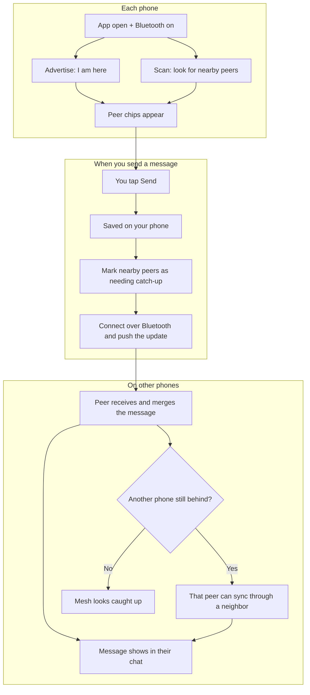

# Bluetooth Mesh Chat

A peer-to-peer chat app that syncs messages over Bluetooth Low Energy — no Wi‑Fi or cellular required. Nearby phones form a small mesh and share chat history automatically.

Building or debugging the project? See **[DEVELOPMENT.md](DEVELOPMENT.md)**.

---

## What you need

- An Android phone (API 24 / Android 7 or newer)
- Bluetooth turned on
- Nearby Devices / Bluetooth permissions allowed when prompted  
  (on older Android, Location may also be required for BLE scanning)

Install the app on two or more phones that are near each other. Each phone is one node in the mesh.

---

## How the mesh works

Every phone does the same jobs. There is no “server” phone — each device both **listens** and **shares**.

### What each role means

| Role | What that phone does |
|------|----------------------|
| **Sender** | Saves the message locally, then actively tries to deliver it to peers that are behind |
| **Direct peer** (green chip) | Talks Bluetooth straight to the sender and merges the update |
| **Indirect peer** (yellow chip) | Not in radio range of the sender, but can still get the message via a phone in the middle |
| **Every phone** | Keeps advertising, scanning, and comparing “are we caught up?” so the history converges |

So in a three-phone line `A ↔ B ↔ C`, if **A** sends:

1. **A** stores the message and syncs with **B**.
2. **B** merges it, then can sync with **C**.
3. **C** gets the message even without a direct link to **A**.

---

## Getting around

The bottom bar has two tabs:

| Tab | What it’s for |
|-----|----------------|
| **Messages** | Chat with the mesh and see nearby peers |
| **Configuration** | Your display name, mesh identity, and radio diagnostics |

---

## Messages

1. Type in the composer at the bottom and tap **Send**.
2. Your message is stored on your phone and synced to nearby peers over Bluetooth.
3. Peers appear as chips along the top of the Messages screen.

### Peer chips

Chip **color** is connection status:

| Color | Meaning |
|-------|---------|
| Green | Direct Bluetooth link |
| Yellow | Reachable through another peer (multi-hop) |
| Grey | Known recently, but not currently reachable |

The **leading icon** is mesh sync status (same green / yellow / grey tint as connection):

| Icon | Meaning |
|------|---------|
| Check | This peer looks caught up with the mesh |
| Sync problem | This peer is behind (missing recent messages) |
| Help | Sync status not known yet |

Tap a chip for details: node ID, MAC (when known), connection path, and whether the mesh is caught up.

---

## Configuration

- **Mesh Identity** — your stable node ID (shared with the mesh; not the same as your display name).
- **Display Name** — what others see in chat. Leave empty to show a short form of your node ID.
- **Diagnostics** — Bluetooth, location, scanner health, and permission status.
- **Restart Mesh Radio** — rebuilds the mesh radio stack if peers stop appearing or sync stalls.
- **Turn Bluetooth Off and On** — full Bluetooth power cycle when the radio is wedged (may take a few seconds).

---

## Tips

- Keep phones unlocked and the app open (or recently used) while testing sync — background limits can slow discovery.
- After changing a display name, give the mesh a moment to propagate it.
- If chips never appear: confirm Bluetooth is on, permissions are granted, and try **Restart Mesh Radio**.
- Two phones can chat directly; a third phone can still receive messages through a middle peer when it is yellow.

---

## Privacy note

Traffic stays on the local Bluetooth mesh. There is no central chat server. Anyone in radio range who runs the app and joins the same mesh can receive shared messages and profiles.

---

## Platform support

- **Android** — supported today (API 24+).
- **iOS** — planned (not shipping yet).
- **Linux** and **web** — possible future targets; scaffolding may exist, but mesh chat is not productized there yet.

Windows and macOS desktop targets are not in scope and have been removed from the repo.
