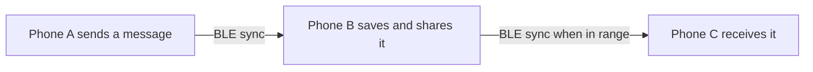

# Meshenger

Meshenger is a nearby chat app for Android. Phones discover one another over Bluetooth Low Energy (BLE) and exchange chat history directly, without Wi-Fi, mobile data, or a central server.

## Download

When a release is available, download Meshenger from the [GitHub Releases page](https://github.com/ebregger/Meshenger/releases). Choose the **universal APK** for most Android phones. The other APKs are split by processor type. Download only from the project’s Releases page.

## How the mesh works

Each phone is an equal participant in the mesh. It keeps its own local copy of the chat and continuously looks for nearby Meshenger phones while Bluetooth is available.

When a phone finds a peer, the two compare compact fingerprints of their local data. If the fingerprints differ, they connect over BLE and exchange the records each side is missing. Both phones merge the received records into their local chat. The conversation can therefore catch up in either direction.

Messages can travel across multiple phones through repeated exchanges. For example, if A can reach B and B can reach C, A’s message can reach C when C syncs with B. B stores and shares the same chat history; it does not route a live packet to a specific destination. Phones do not need to be on the same Wi-Fi network.



Sync happens when nearby phones discover one another and have an opportunity to connect. It is not guaranteed to be immediate, especially when phones are out of range, Bluetooth permissions are unavailable, or Android restricts background activity.

## Privacy

Meshenger has no central server, but the current mesh traffic is **not encrypted**. Messages, user IDs, and display names are sent as readable data over Bluetooth. Nearby people with suitable BLE tools may be able to capture that traffic, even if they do not use Meshenger. Treat the shared chat as public to people within radio range. Do not send sensitive information.

## Screenshots

<p align="center">
  
</p>

## Get started

1. Install the APK on two or more Android phones.
2. Turn on Bluetooth and allow the requested nearby-device permissions.
3. Open Meshenger on each phone and keep the screens on and unlocked while trying the first sync. Debug builds request that the screen stay on while Meshenger is in the foreground; this does not wake a sleeping display or bypass the lock screen. Release builds follow the phone's normal screen timeout.
4. Send a sample message. Nearby peers should appear as chips, and the message should arrive as the phones sync.

The **Messages** tab contains the shared conversation and nearby peers. Tap a peer chip to see its details. The **Configuration** tab lets you set a display name, check permissions and radio diagnostics, and restart the mesh radio if discovery or syncing stalls.

## Current capabilities

- Android app with BLE peer discovery and direct phone-to-phone data exchange.
- Shared chat history that syncs and merges across peers, including through a phone that is in range of both sides.
- Display names, peer presence indicators, sync status, and basic radio diagnostics.

Keep the app open and phones nearby while evaluating sync. Android background and battery limits can interrupt scanning or connections when the app is not in use.

## BLE stress baseline

On 2026-09-24, the three-phone stress test sent 300 messages round-robin (100 from each phone), after clearing prior chat rows. It measured completion when each message appeared in the other phones' `/ui` chat lists, polling about every two seconds. ADB controlled the apps; BLE carried the phone-to-phone sync.

| Run | Delivery | Mean / p50 / p95 / max latency | Throughput | Connection failures / penalty entries |
| --- | --- | --- | --- | --- |
| Earlier 300-message run | 300/300 in 268.77s | 60.18s / 21.92s / 239.48s / 259.71s | 1.12 msg/s, 1.91 KB/s | 74 / 67 |
| Debug-awake repeat | 300/300 in 1,009.92s | 189.61s / 72.40s / 736.36s / 977.10s | 0.30 msg/s, 1.65 KB/s | 201 / 178 |

Run the general benchmark with `python stress_test.py --messages 300`. It clears old chat rows by default so receipt counts stay consistent. Before sending, the runner inventories ADB devices, creates missing local forwards for the default all-device run, checks every selected `/info` endpoint, requests a BLE reset, and records the port-to-phone mapping. It stops with a preflight error if a default-run phone is offline, its API is unreachable, or selected ports resolve to duplicate nodes. Use `--ports` to deliberately test a subset; those exact ports must already be forwarded. Preflight details are written to the `.log` and successful-run JSON summary.

For directed-pair and distance baselines, pass only the two device ports and choose one sender. Run once per direction; the sweep records measured RSSI, device-local GATT phase timings, delivery ratio, and the supplied distance/environment labels:

```powershell
python -m tools.load_sweep --ports 18081,18083 --sender-port 18081 --messages 20 --intervals-s 2,1 --repeats 2 --distance-m 2 --environment-label "desk, clear line of sight"
```

Repeat with `--sender-port 18083` for the reverse direction. The sweep waits 15 seconds between runs and stops below 99% full propagation by default. Add `--continue-on-failure` to collect later load steps for diagnosis. `--cooldown-s` and `--min-delivery-ratio` adjust those defaults.

The JSON summary keeps end-to-end latency on the host monotonic clock and labels it as first `/ui` observation, with the configured polling interval. GATT stages use each phone's `elapsedRealtime`; compare durations within one phone and do not subtract monotonic values across phones. Notification callback waits, fallback timeouts, and immediate stack rejections are reported separately.

### Near-field held-link check after handler fix (2026-09-25)

A 30-message interactive run from the Android 15 Pixel 3 to the Pixel 9 Pro XL delivered all messages in 41.26 seconds. Mean / p50 / p95 / max latency was 1.18 / 0.41 / 11.77 / 12.10 seconds, with 0.73 msg/s throughput and no connection failures, rejections, or send failures. The phones were awake and unlocked, with measured RSSI around -32 to -38 dBm.

Compared with the earlier 30-message run on the same pair and profile (2.32-second mean, 0.37-second p50, 12.30-second p95, 13.11-second max, 0.40 msg/s), this run had fewer outbound connection starts (two versus five) and carried 14 and 16 delta EOF rounds on its first two held sessions before they closed about nine seconds after the first EOF. Earlier traces closed after about 3.2 seconds and six EOF rounds. This supports the shared-handler timer fix, but the mean-latency change is not yet conclusive: the new run's 95% normal-approximation interval is 0.13 to 2.23 seconds (n=30). Two messages still took about 12 seconds and were reported as catching up during the live burst; investigating sync scheduling and backlog catch-up is the next step.

### Interrupted callback diagnosis (2026-09-25)

The 60-message run with one-second send spacing was stopped at about 110.4 seconds, so it has no final pass/fail verdict. At the interruption, 10/60 messages from the Pixel 9 had appeared on Pixel 3 `88LX01L45`, 0/60 on Pixel 3 `8AKX0UCPK`, and 0/60 had reached every peer.

The trace recorded 20 MTU requests returning `STARTED=true`, two `CLIENT_MTU_READY` callbacks, and no `CLIENT_MTU_FAILED` callbacks. Among those 20 request IDs, 14 ended in a request-phase failure without an MTU callback, two disconnected before a callback, and two had no terminal event when the log ended. The complete trace also contains 17 `transfer_timeout` failure events in `request_mtu`; failure events can overlap for one attempt, and two lack a matching `CLIENT_MTU_REQUESTED` record, so event totals are not mutually exclusive.

The app advances to service discovery only from the successful `onMtuChanged` callback. A 15-second transfer watchdog closes an attempt that remains in `request_mtu`; although the client has a conservative 20-byte chunk default, there is no timeout fallback that proceeds to discovery with it. The test therefore establishes that the app did not observe an MTU callback before those attempts failed or the trace ended. It does not establish why Android did not deliver one.

There is clear connection pressure in the same trace: 23 inbound connections were rejected while the single inbound slot was active (17 `inbound_cap_1`, six `stale_pending_slot_releasing`), with six pending-slot eviction requests. Using each phone's own elapsed-realtime timestamps, 16 of the 18 request IDs without an MTU callback overlapped an inbound server connection with both connection and disconnection events; the remaining two overlapped inbound connections still open when capture ended. This makes competing inbound/outbound activity the strongest visible correlate, but timing overlap alone does not prove it suppressed the MTU callback.

The interrupted run did not record lock state or Android Bluetooth framework logs, so it cannot distinguish connection contention from a locked/dozing phone or an internal GATT stack problem. The stress runner now records screen, wakefulness, device-lock, focus, idle, and Bluetooth-enabled state before and after the run and samples runtime state every five seconds. It also captures selected Android Bluetooth/GATT log tags, each MTU request/callback/disconnect, and timestamped inbound/outbound connection activity. State samples and logcat observations share host monotonic timestamps; connection overlap is calculated only within a phone's clock. The per-run JSON summary retains these samples and selected stack log lines, while the details log gets state samples and MTU/GATT failure lines as they occur so an interrupted run still preserves them. These observations narrow the diagnosis, but an internal controller/stack fault may still require a Bluetooth HCI snoop trace if framework logs remain inconclusive.

### Completed lock/GATT diagnostic run (2026-09-25)

The follow-up three-phone burst sent 60 messages at one-second spacing and ran for 303.91 seconds. It delivered 0/60 messages to all peers, with 0.00 msg/s measured throughput. All three phones reported Bluetooth enabled, device idle mode off, awake, and unlocked at the start, during samples, and at the end. Lock state therefore does not explain this run's outage.

The Android 15 Pixel 3 started four `requestMtu(512)` operations. The captured `BluetoothGatt` logs show all four `configureMTU()` requests and no matching completion line; the app received neither a ready nor a failed MTU callback, and all four attempts ended in `transfer_timeout`. The run also had 74 client `connect_timeout` failures before the MTU phase, so most connection attempts never reached MTU negotiation.

Each of the four no-callback MTU intervals overlapped an inbound server link on that phone. Across the run there were 78 outbound connection starts, seven accepted inbound connections, one rejection for `stale_pending_slot_releasing`, and one pending-slot eviction; none of the four MTU waits overlapped another outbound connection start. This makes inbound connection contention a plausible contributor, but four correlated attempts do not establish cause.

The Android 9 Pixel 3 logged `DeadObjectException` while the runner was resetting and closing its GATT server at startup. Later it logged `bta_gatts_cancel_open` errors and connection disconnect reason `0x0013`, around teardown of stalled links. The startup exception occurred during reset, and these server-side logs do not identify why the Android 15 Pixel 3 received no MTU callback. The current evidence rules out lock state for this run and shows both connection and GATT-stack symptoms; it does not yet separate Android's GATT stack from inbound connection contention. A Bluetooth HCI snoop trace would show whether the controller received an MTU response that the framework failed to deliver.

### Directed GATT diagnosis

Run `stress_test.py` with `--hci-diagnostic` to check the full Bluetooth HCI snoop setting before starting and to collect per-phone snoop artifacts after the run. The runner reports the setting and root access result for each selected phone. It stops before sending if snoop is not explicitly in Full mode. On Android 15, choose **Full** for the Bluetooth HCI snoop log in Developer options; on Android 9, enable the snoop toggle. Restart Bluetooth on both phones after changing the setting. The rooted Android 9 Pixel 3 can provide its raw `/data/misc/bluetooth/logs/btsnoop_hci.log`; other phones are collected through their bugreport, and only decoded snoop files are retained.

`--devices` selects phones by ADB serial and creates the needed API forwards for only those devices; `--sender-device` fixes the message origin. To compare connection direction without involving the Pixel 9, run the same two-phone burst once from each Pixel 3:

```powershell
python stress_test.py --devices 8AKX0UCPK,88LX01L45 --sender-device 8AKX0UCPK --messages 20 --send-interval-s 2 --hci-diagnostic
python stress_test.py --devices 8AKX0UCPK,88LX01L45 --sender-device 88LX01L45 --messages 20 --send-interval-s 2 --hci-diagnostic
```

The screen, lock, idle, and Bluetooth state checks remain part of each run. The BLE summary compares missing MTU callbacks with inbound links, overlapping outbound attempts, connection failures, and Android stack logs. The `.btsnoop` files can then show whether an ATT MTU response reached the phone's controller/framework path. The raw captures can contain sensitive Bluetooth traffic, so the test stores them in ignored per-run `_bluetooth` folders instead of checking them into Git.

## Planned work

- Keep BLE scanning and connections active more reliably in the background with an Android foreground service.
- Show local notifications for incoming messages.
- Decide and implement a stronger privacy model, including encryption if private conversations are needed.
- Add chat history clearing and retention controls.
- Support direct one-to-one conversations.
- Add message timestamps, copy actions, and clearer delivery progress.
- Configure release signing with a consistent release keystore.
