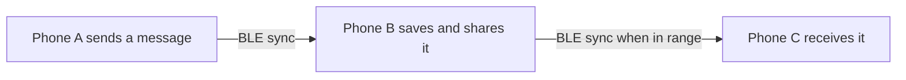
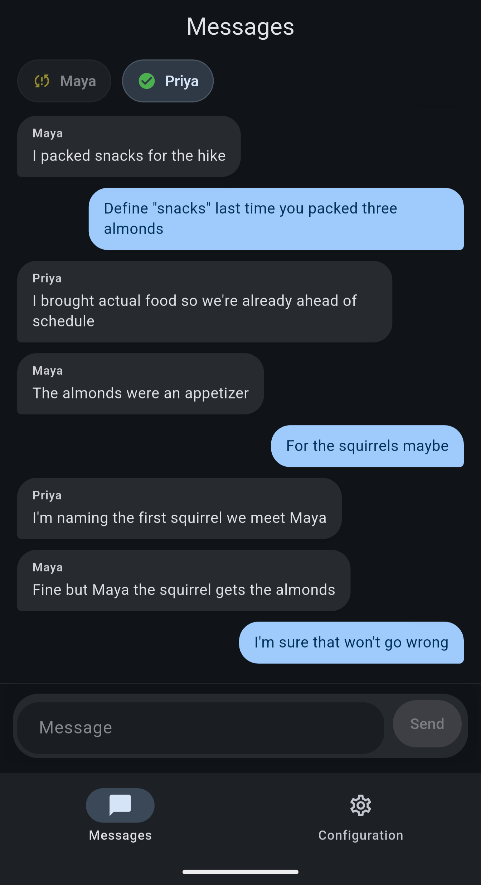

# Meshenger

Meshenger is a nearby chat app for Android. Phones discover one another over Bluetooth Low Energy (BLE) and exchange chat history directly, without Wi-Fi, mobile data, or a central server.

## Download

When a release is available, download Meshenger from the [GitHub Releases page](https://github.com/ebregger/Meshenger/releases). Choose the **universal APK** for most Android phones. The other APKs are split by processor type. Download only from the project’s Releases page.

## How the mesh works

Each phone is an equal participant in the mesh. It keeps its own local copy of the chat and continuously looks for nearby Meshenger phones while Bluetooth is available.

When a phone finds a peer, the two compare compact fingerprints of their local data. If the fingerprints differ, they connect over BLE and exchange the records each side is missing. Both phones merge the received records into their local chat. The conversation can therefore catch up in either direction.

Messages can travel across multiple phones through repeated exchanges. For example, if A can reach B and B can reach C, A’s message can reach C when C syncs with B. B stores and shares the same chat history; it does not route a live packet to a specific destination. Phones do not need to be on the same Wi-Fi network.


```mermaid
flowchart LR
    A[Phone A sends a message] -->|BLE sync| B[Phone B saves and shares it]
    B -->|BLE sync when in range| C[Phone C receives it]
```

Sync happens when nearby phones discover one another and have an opportunity to connect. It is not guaranteed to be immediate, especially when phones are out of range, Bluetooth permissions are unavailable, or Android restricts background activity.

## Privacy

Meshenger has no central server. The shared room is still a public conversation: anyone running Meshenger nearby can read it, and those messages are stored in plaintext so every peer can show them. Do not put sensitive information in the shared room.

Direct chats are encrypted. Each install keeps an X25519 private key on the phone and publishes only the public key. A private message is sealed with AES-GCM under a key derived from the two participants' keys. Relays store and forward the ciphertext, and the app shows them "Private message" instead of the contents. User IDs, timestamps, and the fact that a private chat exists still travel with the mesh record. A passive Bluetooth capture of a private message is not readable without one of the two private keys.

## Screenshots

<p align="center">
  
</p>

## Get started

1. Install the APK on two or more Android phones.
2. Turn on Bluetooth and allow the requested nearby-device permissions.
3. Open Meshenger on each phone and keep the screens on and unlocked while trying the first sync. Debug builds request that the screen stay on while Meshenger is in the foreground; this does not wake a sleeping display or bypass the lock screen. Release builds follow the phone's normal screen timeout.
4. Send a sample message. Nearby peers should appear as chips, and the message should arrive as the phones sync.

The **Messages** tab contains the shared conversation and nearby peers. **Everyone** is the shared room. Tap a peer chip, then **Private chat**, to open an encrypted one-to-one thread. Your own messages show **Sent** until a later sync finishes, then **Delivered**. The trash icon clears the open conversation and syncs that removal.

The **Configuration** tab lets you set a display name, choose how long to keep messages, clear the shared room, check permissions and radio diagnostics, and restart the mesh radio if discovery or syncing stalls. Keeping messages for 1, 7, or 30 days removes older messages you sent or received and syncs those removals. Relayed private chats you are not part of stay on the phone so they can still reach their recipients. Debug Android builds also show a **Developer Testing** option to hold a partial CPU wake lock during screen-off BLE tests. It leaves the display and lock screen unchanged, and turns off when disabled or when the mesh foreground service stops.

## Current capabilities

- Android app with BLE peer discovery and direct phone-to-phone data exchange.
- Shared chat history that syncs and merges across peers, including through a phone that is in range of both sides.
- Encrypted direct conversations relayed as ciphertext.
- Chat clearing and retention controls that sync removals for conversations you participate in.
- Sent and delivered progress on your own messages.
- Display names, peer presence indicators, sync status, and basic radio diagnostics.

Keep the app open and phones nearby while evaluating sync. Android background and battery limits can interrupt scanning or connections when the app is not in use.

## Recent test results

Latency is measured from message submission until the message first appears in the receiving phone's `/ui` chat list. The test polls every 100 ms. Throughput counts messages that reached all peers per second of run time.

| Test | Delivery | UI-observed latency (mean / p50 / p95 / max) | Throughput |
| --- | --- | --- | --- |
| Two-peer long run (1,000 messages) | 1,000/1,000 (100%) | 1.28 / 1.29 / 1.61 / 17.53 s | 0.72 msg/s |
| Three-peer mesh, round-robin (60 messages) | 60/60 (100%) | 2.91 / 1.12 / 11.88 / 16.31 s | 0.33 msg/s |

The long two-peer run recorded one connection failure and no send failures. The three-peer run recorded no connection failures, nine connection rejections, zero penalty entries, and no send failures.

## Release signing

Release builds use one upload keystore, not the debug key. Create it once and keep the same files for later releases:

```powershell
powershell -File tools/create_release_keystore.ps1
```

That writes `android/key.properties` and `android/app/upload-keystore.jks`. Both are gitignored. Running the script again leaves the existing key in place. `assembleRelease` and `bundleRelease` fail with setup instructions when those files are missing. Debug builds still install without them.
